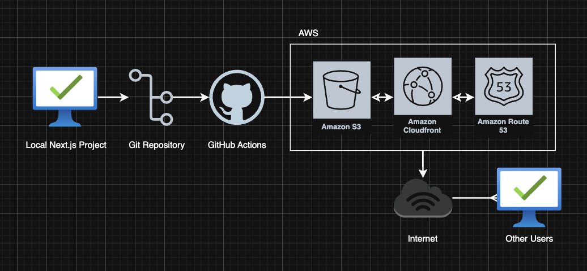
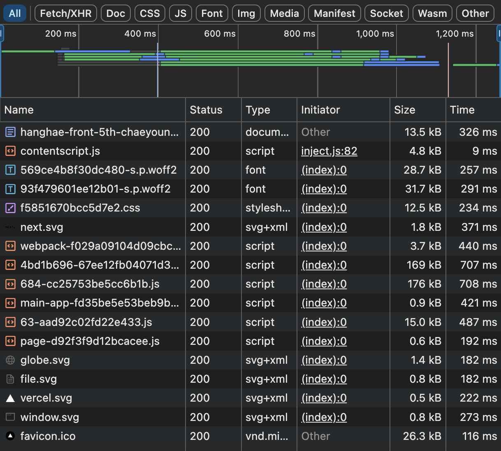
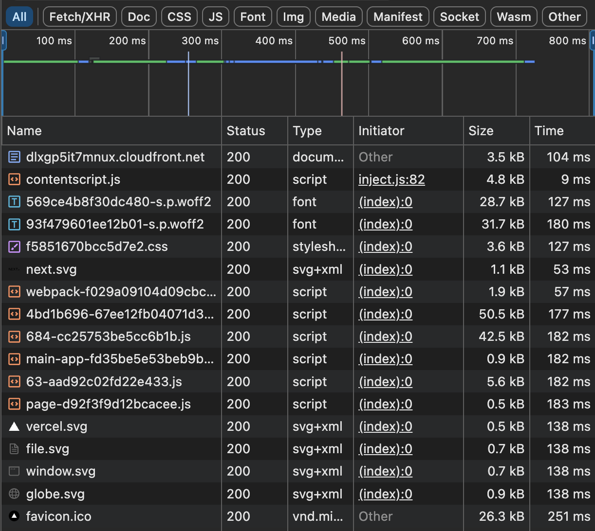
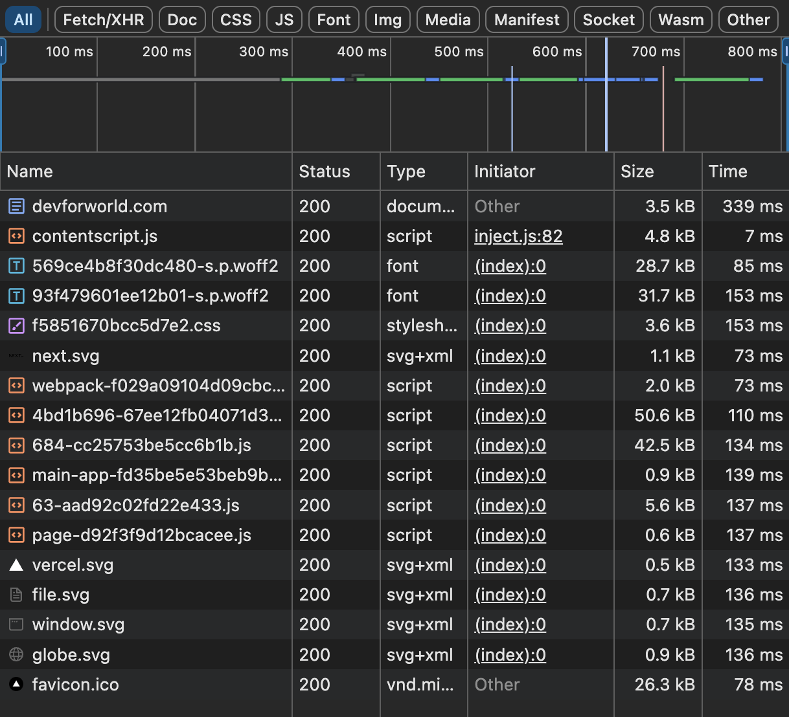

# Chapter 4-1. 인프라 관점의 성능 최적화

## 배포링크
- S3 버킷 웹사이트 엔드포인트
  - [http://hanghae-front-5th-chaeyoung.s3-website.ap-northeast-2.amazonaws.com](http://hanghae-front-5th-chaeyoung.s3-website.ap-northeast-2.amazonaws.com)
- CloudFront 배포 도메인
  - [https://dlxgp5it7mnux.cloudfront.net/](https://dlxgp5it7mnux.cloudfront.net/)
- Route53을 활용한 대체 도메인
  - [https://devforworld.com/](https://devforworld.com/)

## 기본 과제

GitHub과 AWS를 사용해 CDN이 적용된 프론트엔드 프로젝트 CI/CD 파이프라인을 구성합니다.

## 심화 과제

인프라 레벨 최적화, 특히 CDN을 사용한 최적화를 이해하고 성능 개선을 위한 사전 작업인 ‘모니터링’을 준비합니다.

## 주요 개념

- GitHub Actions과 CI/CD 도구
  - GitHub 저장소와 연동되어 코드 변경 시 자동으로 빌드·테스트·배포 파이프라인을 실행해 주는 워크플로우 플랫폼
  - 주요 역할 - PR 생성·머지 시 자동 테스트 실행, 브랜치별 릴리즈 빌드, S3/CloudFront 배포 스크립트 트리거 등
  - 핵심 이점 - 수동 배포 오류 감소, 배포 속도·일관성 확보, 코드 퀄리티 유지

- S3와 스토리지
  - AWS의 객체(Object) 스토리지 서비스로, 정적 파일(HTML/CSS/JS, 이미지 등)을 저장·관리
  - 특징: 무제한 용량, 높은 내구성(99.999999999%), 버전 관리 및 수명 주기 정책 지원
  - 활용 사례: Next.js output: export 결과물 호스팅, 사용자 업로드 파일 보관, 로그 백업
- CloudFront와 CDN
  - AWS의 콘텐츠 전송 네트워크 서비스(CDN)로, 전 세계 엣지 로케이션에 캐시된 콘텐츠를 사용자에게 빠르게 전달
  - 동작 흐름: 사용자 요청 → 가장 가까운 엣지서버 조회(Cache Hit/Miss) → 원본(S3/Origin) 요청 → 캐싱 후 응답
  - 장점: 지연 시간(latency) 단축, 트래픽 급증 시에도 부하 분산, SSL·WAF 통합 가능
- 캐시 무효화(Cache Invalidation)
  - 이미 캐시된 콘텐츠를 강제로 갱신(삭제)하여 최신 버전이 엣지 로케이션에 배포되도록 하는 과정
  - 사용 시점: 코드·애셋 변경 후 CloudFront가 이전 파일을 계속 서비스할 때
  - 방법: CloudFront Invalidation API 호출 또는 콘솔에서 경로 지정(/*) 후 무효화 요청
- Repository secret과 환경변수
  - CI/CD 파이프라인에서 사용되는 민감 정보(API 키, AWS 자격증명 등)를 안전하게 저장·주입하는 기능
  - 구성 방식: GitHub Settings → Secrets에 키·값 등록 → 워크플로우 파일에서 ${{ secrets.AWS_ACCESS_KEY_ID }} 등으로 참조
  - 보안 관리: 평문 커밋 방지, 최소 권한 원칙 적용, 필요 시 주기적 값 회전

## CDN과 성능최적화

- (CDN 도입 전과 도입 후의 성능 개선 보고서 작성)
- https://pagespeed.web.dev/

## 아키텍처

1. 트리거 설정

  - main 브랜치로 push가 발생하거나, GitHub UI에서 수동으로 workflow_dispatch를 실행할 때 작동합니다.
2. 코드 체크아웃
  - actions/checkout@v4 액션으로 저장소의 현재 커밋을 가져옵니다.
3. 프로젝트 의존성 설치
  - npm ci 명령어로 package-lock.json 기준의 의존성을 깨끗하게 설치합니다.
4. Next.js 빌드
  - npm run build 을 실행해 정적 산출물(out/ 폴더)을 생성합니다.
5. AWS 자격 증명 구성
  - aws-actions/configure-aws-credentials@v4.1.0 액션으로 AWS_ACCESS_KEY_ID, AWS_SECRET_ACCESS_KEY, AWS_REGION 시크릿을 사용해 CLI 자격 증명을 주입합니다.
6. S3 배포
  - 기존 객체를 aws s3 rm … --recursive로 전체 삭제한 뒤,
7. aws s3 cp out/ … --recursive로 새로 빌드된 파일을 업로드해 동기화합니다.
8. CloudFront 캐시 무효화
  - aws cloudfront create-invalidation 명령으로 배포 ID(CLOUDFRONT_DISTRIBUTION_ID 시크릿) 대상의 모든 경로("/*") 캐시를 즉시 비웁니다.

## 네트워크 탭으로 비교해보기
<table>
  <tr>
    <td align="center"><strong>S3</strong></td>
    <td align="center"><strong>CloudFront</strong></td>
  </tr>
  <tr>
    <td></td>
    <td></td>
  </tr>
</table>

<table>
  <tr>
    <td align="center"><strong>CloudFront</strong></td>
    <td align="center"><strong>Route 53</strong></td>
  </tr>
  <tr>
    <td></td>
    <td></td>
  </tr>
</table>

### CDN 적용 성능 비교

**측정 도구** : Chrome DevTools ▸ Network 탭 ▸ `time` 

| 배포 경로                                     | 관찰된 time   | 절대 차이       | 상대 개선(%)    |
| ----------------------------------------- | ---------- | ----------- | ----------- |
| **CloudFront  (https://dlxgp5it7mnux.cloudfront.net/)**      | **104 ms** |             |             |
| **Route 53 직행  (https://devforworld.com/)** | 303 ms     | **-199 ms** | **-65.7 %** |

---

## 1. 왜 CloudFront가 더 빠를까?

| 관찰 항목         | CloudFront 동작                                                                                                                                                              | Route 53 + Origin 동작                                                                                                |
| ------------- | -------------------------------------------------------------------------------------------------------------------------------------------------------------------------- | ------------------------------------------------------------------------------------------------------------------- |
| **네트워크 경로**   | Anycast DNS로 사용자를 **가장 가까운 Edge Location**(POP)으로 라우팅 후, AWS 백본망에 탑승해 Origin까지 연결 — 공개 인터넷 홉 수·RTT 최소화 ([AWS 문서][1], [Amazon Web Services, Inc.][2])                       | Route 53은 **오직 DNS 해석**만 수행. 실제 HTTP 요청은 사용자의 ISP → 대륙 간 인터넷 → VPC / S3 Origin까지 그대로 전달되어 더 긴 RTT를 가짐 ([Medium][3]) |
| **캐싱·TTFB**   | Edge POP 캐시에 히트 시, TTFB가 로컬 LAN 수준으로 급감(수 ms). 미스 시에도 POP ↔ Origin 사이에 **지속적 keep-alive & 최적화된 TCP 윈도우**를 사용해 최초 바이트 도착을 앞당김 ([AWS 문서][4], [Amazon Web Services, Inc.][2]) | 매 요청마다 Origin (예: ap-northeast-2 S3)에서 직접 파일을 읽어야 하므로 디스크 I/O + 지역간 네트워크 지연이 TTFB에 그대로 반영                           |
| **프로토콜 최적화**  | POP에서 TLS 종단, HTTP/2·HTTP/3 지원, 헤더 압축, 커넥션 멀티플렉싱 → 단일 RTT로 다수 리소스 전송                                                                                                       | Origin까지 TLS 핸드셰이크·TCP 3-way handshake RTT를 매번 소모; HTTP/1.1 일 경우 직렬 전송 부담                                           |
| **인터넷 혼잡 영향** | AWS 글로벌 네트워크 내부(전용 파이버)로 치환되어 패킷 손실·지터 감소                                                                                                                                  | 공용 인터넷 경유이므로, 피크 시간 혼잡·라우팅 우회 시 레이턴시 상승 가능                                                                          |

CloudFront는 CDN(Edge Caching + Optimized Backbone)이고, Route 53은 DNS일 뿐이라서 `한 단계가 더 있다`기보다는 **가장 느린 구간(사용자 ↔ Origin)을 CDN이 대신 처리**하기 때문에 오히려 전송이 빨라진다.

## 2. 세부 분석

1. **대부분의 199 ms 차이 = TTFB 구간**

   * CloudFront 캐시 HIT 시: TTFB ≈ 5 \~ 15 ms (POP 내 RAM → 바로 응답)
   * MISS 시에도: POP → Origin 구간이 AWS 백본으로 단축되어 일반 인터넷보다 평균 30 \~ 70 ms 빠름.
2. **연결 오버헤드 제거**

   * TLS 및 TCP 세션이 POP에서 재사용되어, 브라우저는 한 RTT로 6-pack 리소스까지 병렬 전송.
3. **HTTP/3 효과(선택 적용)**

   * CloudFront는 HTTP/3 (QUIC) 배포를 지원한다. 손실 환경에서 재전송 지연이 더 짧아 모바일-LTE에서 차이가 확대됨.

## CDN 역할 파악하기

S3 정적 사이트 배포와 CloudFront를 이용한 배포로 CDN 역할 이해하기

| 배포 경로 | `time` (ms) | 절대 차이 | 상대 개선 |
|-----------|------------:|----------:|----------:|
| **CloudFront**   (`https://dlxgp5it7mnux.cloudfront.net/`) | **104** | — | — |
| **S3 정적 사이트**  (`http://hanghae-front-5th-chaeyoung.s3-website.ap-northeast-2.amazonaws.com`) | 326 | **-222 ms** | **-68.1 %** |

| 구분 | CloudFront | S3 정적 사이트 엔드포인트 |
|------|------------|---------------------------|
| **지리적 위치** | 120 개 이상 Edge Location 중 사용자와 가장 가까운 POP에서 응답 | **단일 리전(서울 ap-ne-2)**에만 존재 → 모든 사용자가 해당 리전까지 왕복 |
| **네트워크 경로** | Anycast DNS + AWS 전용 백본망으로 Origin까지 구간 지연 최소화 | 사용자 ISP → 퍼블릭 인터넷 → S3 리전 → 퍼블릭 인터넷 → 사용자 |
| **캐싱 전략** | Edge RAM/SSD에 객체 저장(HIT 시 디스크 I/O 0) | 캐시 없음: 매 요청마다 S3에서 디스크 읽기 |
| **연결 최적화** | POP에서 TLS 종료, HTTP/2·3 멀티플렉싱, TCP/QUIC 튜닝 | TLS·TCP 핸드셰이크가 리전까지 왕복, HTTP/1.1 직렬 전송 가능성 |
| **가용성·보안** | POP–Origin 간 keep-alive, WAF·Geo 차단·Origin Shield 지원 | S3 ACL·정책으로만 제어, WAF 적용 불가 |

> S3는 “저장소 + 정적 호스팅”까지는 해결하지만,  
> - 지리적으로 한 곳에만 존재  
> - 전용 캐시·백본 최적화가 없음  
> ⇒ 사용자 ↔ S3 사이 RTT·디스크 지연이 고스란히 적용  
> 반면 CloudFront는 **Edge 캐시 + 백본 전송 + 프로토콜 업그레이드**로 3 단계(전송·연결·디스크) 지연을 줄일 수 있음

1. **222 ms 중 약 80 %는 TTFB 차이**
   * CloudFront HIT: TTFB 5 ~ 15 ms  
   * S3: TTFB ≈ 170 ~ 220 ms (리전 RTT + S3 디스크 읽기)  
2. **연결 오버헤드**  
   * CloudFront: TLS 세션을 POP에서 재활용, 한 RTT로 여러 리소스 전달  
   * S3: 객체마다 새 TLS + TCP 연결을 만드는 경우가 많음  
3. **대륙 간 사용자라면 차이가 배 이상**  
   * 도쿄-거주 사용자가 서울 S3에 접근 시 추가 30 ~ 40 ms  
   * CloudFront는 도쿄 POP HIT 시 여전히 10 ms 이하

## 3. 인사이트 정리

### CloudFront vs Route53

* **체감 개선** : LCP 자산(200 KB Hero 이미지) 기준, CDN인 CloudFront 경로가 Route 53 대비 **약 66 % 지연 감소**.
* **비용 대비 효과** : CloudFront 요금은 요청·전송량 기반이지만, Origin 데이터 전송이 줄어들어 S3 Data-Out 비용이 동시에 절감됨.
* **보안·운영 이점** : WAF 통합, Geo 차단, Origin Shield 구성 가능 — 성능 확보와 함께 보안 계층 강화.

## S3 vs CloudFront

| 항목 | 기대 효과 |
|------|-----------|
| **퍼포먼스** | LCP, INP 등 Core Web Vitals 개선 → SEO·전환율 ↑ |
| **비용** | 캐시 HIT 비율이 높아질수록 S3 Data-Out 비용 ↓ |
| **보안·운영** | WAF, Shield, OAC(Origin Access Control)로 보안 레이어 추가 |
| **확장성** | 오브젝트 수 / 트래픽 급증 시에도 Edge 자체 확장, S3 한계 없음 |

### 참고

* CloudFront 가 **글로벌 Edge 네트워크를 통해 “low latency” 전송**을 제공 — AWS Static Website Whitepaper ([AWS 문서][4])
* 요청은 **가장 가까운 POP으로 라우팅**되어 캐시 검사 후 응답 — CloudFront Developer Guide ([AWS 문서][1])
* **POP-Origin 간 최적화된 네트워크 경로** 및 keep-alive 재사용으로 레이턴시 ↓ — AWS Media Blog (Origin Shield) ([Amazon Web Services, Inc.][2])
* **Route 53은 DNS 서비스, CloudFront는 CDN** — Medium “Route 53 vs CloudFront” 정리 ([Medium][3])

[1]: https://docs.aws.amazon.com/AmazonCloudFront/latest/DeveloperGuide/HowCloudFrontWorks.html "How CloudFront delivers content - Amazon CloudFront"
[2]: https://aws.amazon.com/blogs/media/grabyo-optimizes-live-cloud-production-with-amazon-cloudfront-origin-shield/ "Grabyo optimizes live cloud production with Amazon CloudFront Origin Shield | AWS for M&E Blog"
[3]: https://franky-46708.medium.com/route-53-vs-cloudfront-vs-global-accelerator-96277a65b61f "Route 53 vs Cloudfront vs Global Accelerator | by Tak Yu Chan (Franky) | Medium"
[4]: https://docs.aws.amazon.com/whitepapers/latest/build-static-websites-aws/speeding-up-your-amazon-s3-based-website-using-amazon-cloudfront.html "Speeding up your Amazon S3-based website using Amazon CloudFront - Hosting Static Websites on AWS"

## 🚦 Lighthouse 비교

<!-- LHCI-TABLE-START -->
(업데이트: 2025-06-02 12:42 KST)

| Metric | Route53 | CloudFront | S3 |
|--------|------|------|------|
| Performance | - | - | - |
| Accessibility | - | - | - |
| SEO | - | - | - |
| LCP (ms) | - | - | - |
| TTFB (ms) | - | - | - |
<!-- LHCI-TABLE-END -->
